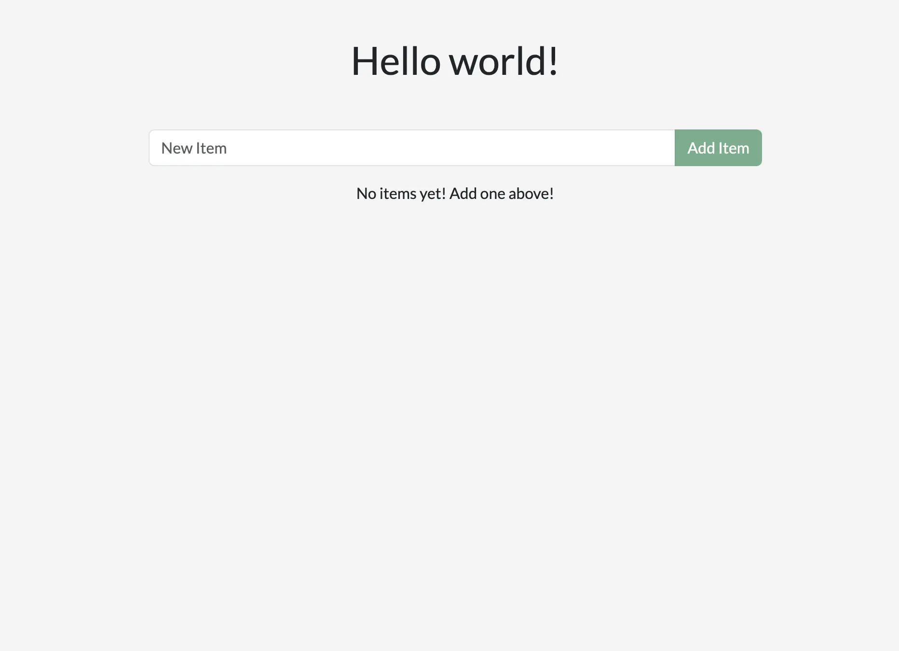
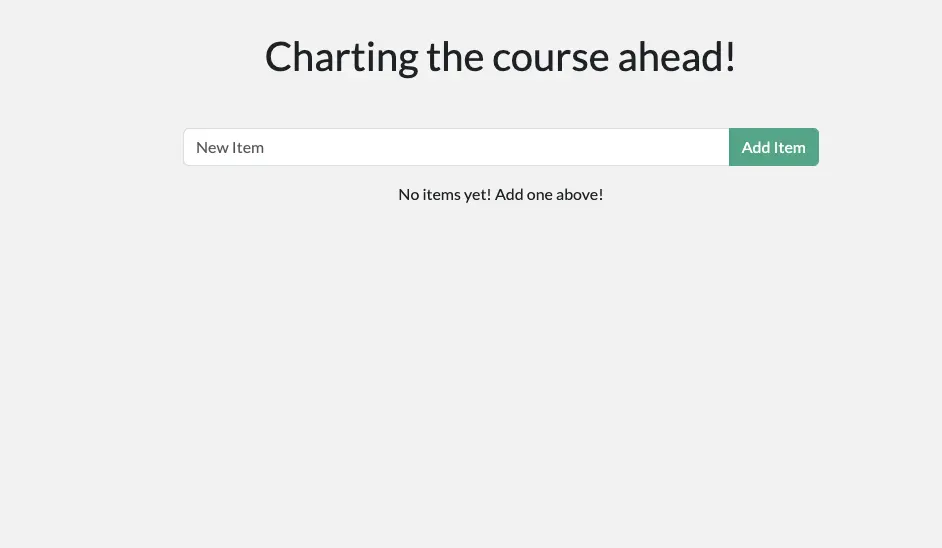
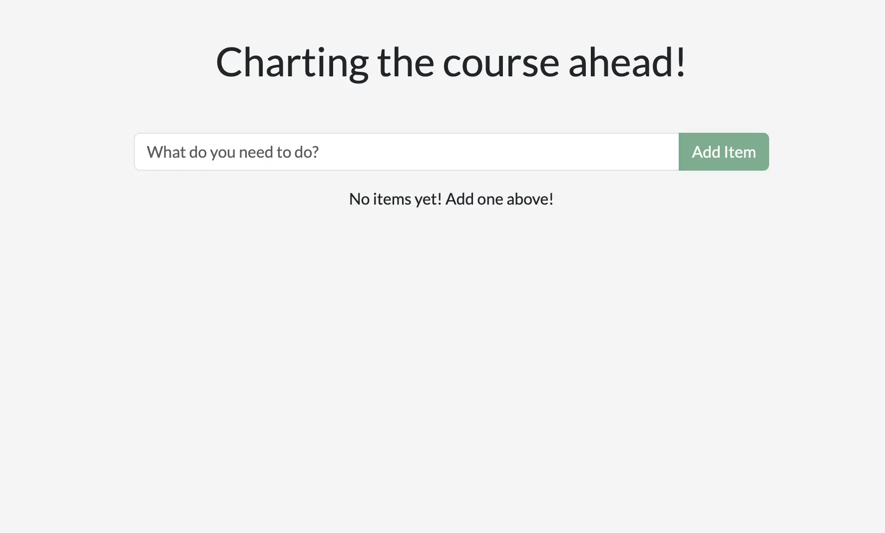
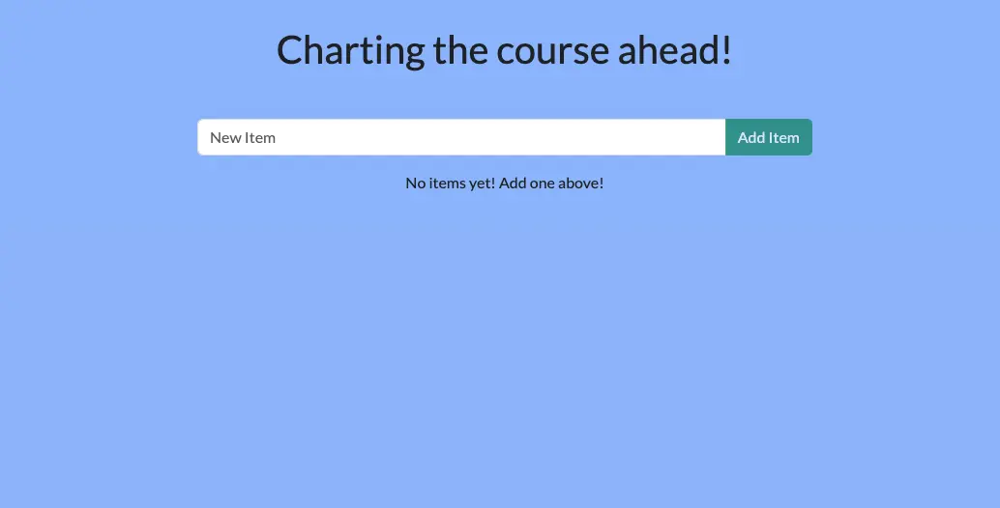

# 是用容器进行开发

## 解释
现在，你已经安装了docker desktop， 你已经准备好了做一些软件开发。尤其是下面的工作流程：
1. 克隆并开启一个开发项目
2. 修改前后端代码
3. 立即查看变更

## 尝试一下

在这个实践教程中，你将学习如何是用容器开发。

## 开始项目

1. 克隆或者下载项目的zip文件到你本地电脑。

```shell
 git clone url
```

克隆玩代码之后， 导航进入新创建的项目目录

```shell
cd projectDir
```
2. 一旦有了项目， 可以是用docker compose开启开发环境。是用命令行界面开启项目， 运行下面的命令：

```shell
docker compose watch
```

你会看到很多输出内容，展示拉取的镜像，开启的容器和其他信息。如果你现在还不是很了解不要担心。一两分钟后，会趋于稳定并完成任务。

3. 打开你的浏览器访问：http://localhost 查看运行的项目。应用运行起来需要几分钟时间。这是一个简单的应用，你可以随意添加一两个项目并标记那些完成了，也可以删除一个项目。



## 环境中有什么

现在环境已经跑起来了， 环境中究竟有什么呢？在高层次， 有几个运行的容器，每个服务都为应用提供独特的功能：

- react前端- a 运行开发服务的node容器
- node后端- 后端接口提供检索、创建，和删除任务项的能力
- mysql数据库 - 保存任务项列表的数据库
- phpmyadmin- 一个基如web的界面，可以和数据库交互，通过http://db.localhost访问
- traefik代理- 是一个应用代理，可以路由到正确的服务。他将发送localhost/api/*请求到后端， localhost/*请求到前端， db.localhost请求到phpmyadmin。 他提供了用80端口访问所有应用的能力。（替代通过不同端口访问不同应用的方案）

是用这个环境，你开发都不用安装和配置很多个服务， 比如填充数据库模式，配置数据库凭证和其他工作。你知需要一个docker desktop工具。剩下的只有开发工作。

## 对应用程序进行修改

有了这个环境， 你就可以对应用做一些修改并了解docker如何帮助我们提供快速反馈循环。

### 修改问候语

界面上方的问候信息由/api/greeting接口提供。 目前，他一直返回“hello world”。 你将将它改为返回三个可以选择的随机消息。

1. 打开backend/src/routes/getGreeting.js文件。这个文件提供了api端点的处理程序。
2. 修改上方包含问候语的数组。随意改为下方选项或者自定义为你喜欢的文本。

```js
const GREETINGS = [
    "Whalecome!",
    "All hands on deck!",
    "Charting the course ahead!",
];

module.exports = async (req, res) => {
...
```

3. 修改端点去发送列表中的问候语，通过做一下变更来实现
```js
module.exports = async (req, res) => {
    res.send({
        greeting: GREETINGS[ Math.floor( Math.random() * GREETINGS.length )],
    });
};
```
4. 如果你还没有这么做， 请保存文件。 如果你刷新你的网页， 你将看到一个新的问候语。如果你不断的刷新， 你将看到所有的问候语。


### 修改占位符文本

当你看到app， 你将看到占位符是简单的“new item”. 你将使它更加具有描述性和趣味性。 你还可以对app的样式做一些修改。

1. 打开 client/src/components/addnewitemform.jsx文件。它提供了添加新元素的组建
2. 修改占位符属性去展示你想展示的内容
```js
<Form.Control
    value={newItem}
    onChange={(e) => setNewItem(e.target.value)}
    type="text"
    placeholder="What do you need to do?"
    aria-label="New item"
/>
```

3. 保存文件然后返回到浏览器。 你将看到修改的内容已经热加载到页面了。 如果你不喜欢， 随意修改直到满意为止


### 修改背景色

在你完成应用程序之前，需要修改更好看的背景色

1. 打开 client/src/index.scss文件
2. 调整背景色属性维你喜欢的颜色。 提供的代码片段糅合蓝色刚好迎合docker的航海风主体。

 如果你使用了ide， 你可以在色彩集成器选择颜色。 否则随意是用一个取色器

 ```
 body {
    background-color: #99bbff;
    margin-top: 50px;
    font-family: 'Lato';
}
 ```
每一次保存都可以在浏览器看到修改内容。不管修改，知道完全适合你。


这样就完成了，公司你完成了网站的修改。

## 扼要重述

离开前，请思考一下在这里发生了什么。利用这点时间，你可以去：

- 不用安装就可以完成项目开发。 容器化环境提供了开发环境，确认你有了需要的所有东西。 你不用去安装node，mysql，和其他任何的依赖在你的机器上。你只需要docker desktop和代码编辑器
- 修改并立刻查看修改。 可以这样的原因是1）每个容器中运行的进程在监听和回应修改。2）容器化环境可以分享文件

docker desktop支持所有这些。你一旦开始思考容器，你可以创建所有的环境并且和同事分享。

## 下一步

现在，应用已经被修改了， 你可以学习如何去打包软件到镜像然后推送到注册表中，尤其是docker hub注册表。
