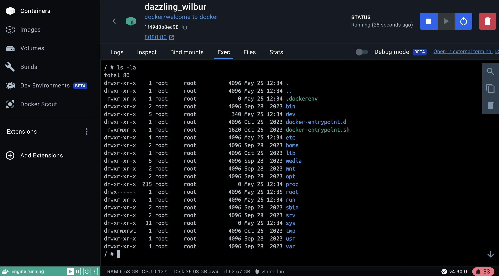
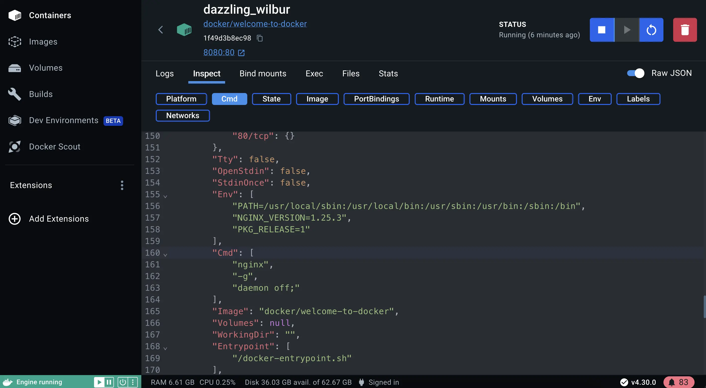

# 获取docker桌面

## 解释

docker desktop是一个构建镜像，运行容器的一体化打包工具。本教程将会引导你完成安装流程， 让你体验他的功能。

docker desktop术语
docker desktop的商业版需要付费订阅

mac版本， windows版本， linux版本

安装完成后，你就可以运行容器了。

## 尝试一下

在实践教程中，你将看到如何在 docker desktop运行一个docker容器。 按照下面的命令去用命令行运行一个容器。

## 运行你的第一个容器

打开命令行终端然后，是永久那个docker run命令启动一个容器：

```docker
docker run -d -p 8080:80 docker/welcome-to-docker
```

## 访问前端

可以通过8080端口访问这个容器。打开网站， 在浏览器中访问http://localhost:8080


## 是用docker desktop管理容器

1. 打开docker desktop然后选择左边侧栏的containers 字段
2. 你可以查看容器日志、文件甚至访问shell命令通过exec标签

3. 选择inspect字段去获取容器的详细信息。你可以执行各种任务，例如：暂停，继续，启动，停止容器，或者查询日志， 绑定挂载， 执行命令， 文件，和统计标签。

docker desktop通过简化设置、配置和不同环境的兼容性来简化容器的管理， 从而解决环境不一致和部署挑战的痛点问题。

## 下一步是什么？

现在你已经学习了docker desktop安装并运行了你的第一个容器， 可以继续学习如何借助容器开发。